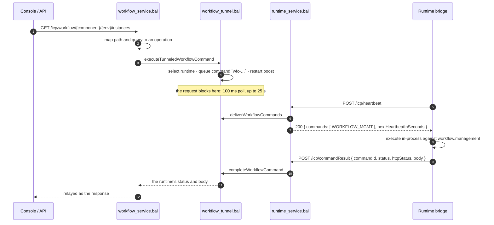

# Workflow Management over the Heartbeat Command Tunnel

This guide explains how ICP manages workflows inside an integration runtime **without ever opening a connection to it** — how a console request becomes a command carried in a heartbeat response, and what happens when things go wrong.

It is the ICP half of the design. The runtime half lives in the bridge:
[`wso2/icp-runtime-bridge` → `docs/command-tunnel.md`](https://github.com/wso2/icp-runtime-bridge/blob/main/docs/command-tunnel.md).

---

## Why a tunnel

Workflow views are read-heavy and interactive: definitions, instances, human tasks, review activities. The obvious implementation is for ICP to call a management API on each integration — which is what the earlier callback-URL proxy did, and it works well as long as everything shares a cluster.

It stops working as soon as ICP and the integrations are separated. Each integration then needs an inbound route published to the ICP cluster, a proxy rule to carry it, and a credential to distribute and rotate — cost that grows with every integration added.

The heartbeat already crosses that boundary in the direction operators allow: **the runtime dials ICP**. The tunnel reuses it. A command is queued here, delivered inside the runtime's next heartbeat *response*, executed in-process by the integration, and answered on a second outbound call. Nothing listens on the integration; no route, port, or credential has to exist for the control plane to reach it.

> **Note on terminology.** This makes the *request flow* bidirectional, not the transport. There is no inbound dial and no duplex socket. A true duplex transport (WebSocket, gRPC streaming) is a possible later step and would keep the same outbound-only property.

---

## The round trip

Step 5 is the heart of it: the command is not a new connection but the **response body of a request the runtime made**.

---

## Selecting a runtime

`selectWorkflowCommandTarget` picks the freshest `RUNNING` runtime for the component and environment whose stored metadata advertises the **`workflowCommands`** capability.

- A runtime advertises that capability only while a workflow integration is registered *and* its bridge has `enableWorkflowManagement = true`. The integration, not the control plane, decides whether it may be managed.
- When no runtime qualifies, the request answers **503** rather than serving cached state. Views go dark when an integration is down; they never show stale data.
- Requests whose path falls outside the operation vocabulary — including the deprecated `/retry-tasks` aliases — answer **404**. They used to reach the runtime through the callback-URL proxy; that proxy is gone, and `runtimes.callback_url` is no longer written (the column stays for schema compatibility).

---

## Waiting for the answer

| | |
|---|---|
| Wait budget | `WORKFLOW_COMMAND_WAIT_SECONDS` = 25s, inside the frontend's 30s |
| Poll granularity | `WORKFLOW_COMMAND_POLL_SECONDS` = 0.1s |
| On expiry | The waiter is dropped **and the queued command is withdrawn**, so a later heartbeat cannot run work nobody is waiting for. The caller receives **504** |
| Late results | A result whose `commandId` has no live waiter is logged and dropped |
| Invalid status | A reported `httpStatus` outside 100–599 is refused with **502** rather than relayed as a malformed response |

The command payload also carries a `deadline` (25s out). The bridge drops an expired command unexecuted, so a delayed delivery cannot produce a late mutation after the caller has given up.

---

## Cadence: the boost ramp

Latency is bounded by heartbeat cadence, so ICP asks a runtime to beat faster while someone is working with it, then lets it settle:

| Idle since the last workflow request | Cadence asked (`nextHeartbeatInSeconds`) |
|---|---|
| 0–5s | 1s |
| 5–10s | 2s |
| 10–20s | 5s |
| 20–30s | 10s |
| 30s+ | no hint — the runtime's own interval |

Every workflow request restarts the ramp, so an active session keeps the fastest cadence. A flat 1s window was the first design and cost too much: an integration serving ordinary traffic kept heartbeating every second long after the last workflow view was closed. The bridge ignores a hint that is not shorter than its own interval, so the last step is a no-op for a runtime already on 10s.

Practical consequences:

- The **first** command after an idle period waits up to one full heartbeat interval (default 10s) — a faster cadence can only take effect on the *next* beat.
- A burst drains quickly: after executing a command the bridge heartbeats again immediately.
- Keep `heartbeatInterval` well below 25s. At or above it, the first command can outlive the waiter and answer 504; the retry then lands in about a second because the runtime is boosted.

---

## Security model

- **Transport**: `POST /icp/commandResult` uses the same `kid`-based JWT validation as the heartbeat endpoints, and answers **202** for any authenticated post — a late result is a normal no-op, not something the bridge should retry.
- **Correlation**: a command records the runtime it was issued to. A result is accepted only from that runtime; one from any other is refused and logged. Every runtime agent in an organization authenticates the same way, so the `commandId` alone must not be enough to answer a command queued for a different runtime — that answer is relayed to the console as the operation's result.
- **Identity**: the console user's `userId` and roles travel in the command payload and are enforced by the runtime's own management API. ICP does not decide what the operation may do; it says who is asking.
- **Capability gating**: `WORKFLOW_MGMT` is only ever queued for runtimes that advertised `workflowCommands`.

---

## Workflow metadata

Definitions need no command at all. Each **full** heartbeat carries the integration's workflow descriptor — definitions, human tasks, activities, agents, with JSON schemas — alongside the runtime's advertised capabilities. Both are consumed together, because target selection needs "has workflows" *and* "accepts commands".

- Storage is delete-then-insert per runtime in `bi_workflow_metadata`; a runtime without workflows simply has no row.
- The Workflows views render from that stored metadata, so a definitions list costs no request into the runtime.
- A component whose heartbeat carries workflow metadata is **promoted** to a workflow integration on its first full heartbeat. A component auto-created from a heartbeat otherwise takes the generic `service` display type, and the integration-level Workflows view keys on `ballerinaWorkflow` — so an auto-registered integration would show no workflow features. A deliberately chosen type is left alone.

> **Schema changes need the bundled database updated too.** The repository ships a pre-built H2 database that `assembleICP` copies into the distribution, and the server never runs the init scripts against it. Adding a table to `h2_init.sql` alone leaves a fresh pack broken — heartbeat processing writes `bi_workflow_metadata` unconditionally, so a missing table fails every full heartbeat. Apply the matching migration from `icp_server/resources/db/migration-scripts/` to the bundled database and commit it.

---

## State and limits

All tunnel state — pending commands, arrived results, live waiters, boost timestamps — is **in memory in a single record**, matching ICP's single-instance architecture (like the runtime hash cache).

- An ICP restart loses in-flight commands. Their callers time out and retry; nothing is left inconsistent, because a command either executed on the runtime or did not.
- This is the piece to redesign before ICP runs in more than one instance: two instances would each hold their own queue, and a result could arrive at the instance that is not waiting for it.

---

## Adding an operation

The vocabulary is shared with the runtime's management API, so both sides must know a new operation:

1. Map the path and method in `mapWorkflowRequestToOperation` (`icp_server/workflow_tunnel.bal`) to its dot-qualified name — `instances.start`, `humanTasks.complete`, and so on.
2. Add any parameters the operation needs to the `params` map, keyed exactly as the management API expects them.
3. Confirm the runtime's `workflow.management` module implements that operation name; an unknown name is rejected at the runtime, not here.

Nothing else changes: queueing, delivery, correlation, timeout, and result relay are operation-agnostic.

---

## Where the code is

| File | Responsibility |
|---|---|
| `icp_server/workflow_service.bal` | The console-facing resource: request → operation mapping, definitions from stored metadata |
| `icp_server/workflow_tunnel.bal` | Queue, waiters, result correlation, boost ramp, target selection |
| `icp_server/runtime_service.bal` | Heartbeat endpoints that carry commands out, and `POST /icp/commandResult` that brings results back |
| `icp_server/modules/storage/heartbeat_repository.bal` | `bi_workflow_metadata` upsert and workflow-integration promotion |
| `icp_server/tests/workflow_tunnel_tests.bal` | Queue, waiter timeout, late/duplicate results, cross-runtime refusal, the boost ramp, and one end-to-end round trip over real HTTP against a simulated bridge |
| `icp_server/tests/workflow_metadata_tests.bal` | Metadata upsert and clear, capability recording, promotion rules |
